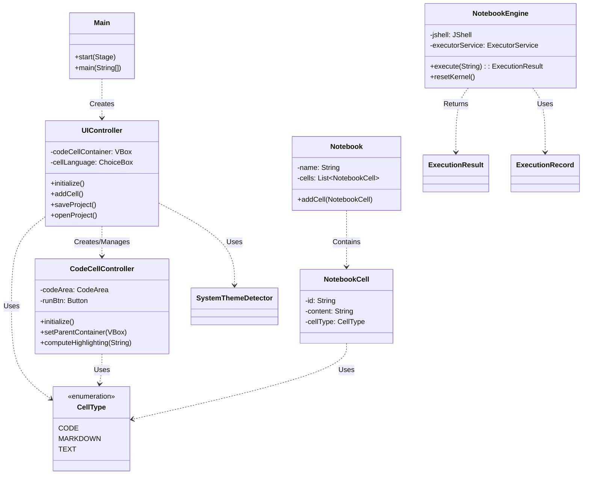

# Vessel Application Analysis

## 1. Code Flow

The application follows a standard JavaFX lifecycle with a separation between UI controllers and the backend kernel.

1.  **Application Startup**:
    *   `Main.main()` launches the JavaFX application.
    *   `Main.start()` loads the `main.fxml` layout.
    *   `FXMLLoader` instantiates `UIController`.
    *   `UIController.initialize()` sets up the initial state (theme, default cell).

2.  **Cell Management**:
    *   `UIController.addCell()` or `addMarkdownCell()` triggers `createCodeCell()`.
    *   `createCodeCell()` loads `CodeCell.fxml`.
    *   `FXMLLoader` instantiates `CodeCellController`.
    *   `CodeCellController` is added to the `codeCellContainer` VBox.

3.  **Code Execution (Current Flow)**:
    *   User clicks the "Run" button in a cell.
    *   `CodeCellController.runBtn` triggers an event handler.
    *   A background `Task` is started to simulate execution (currently a placeholder).
    *   Upon completion (`setOnSucceeded`), the UI is updated with the output.

4.  **Code Execution (Backend Architecture)**:
    *   The `NotebookEngine` class is designed to handle actual code execution using JShell.
    *   It manages a persistent `JShell` instance, handles security (dangerous patterns), and tracks execution history.
    *   *Note: The integration between `CodeCellController` and `NotebookEngine` appears to be pending implementation.*

## 2. Call Graph

```mermaid
graph TD
    subgraph Application Startup
        M[Main.main] --> S[Main.start]
        S --> L[FXMLLoader.load main.fxml]
        L --> UI[UIController.initialize]
        UI --> T[SystemThemeDetector.getSystemTheme]
        UI --> CC[createCodeCell]
    end

    subgraph Cell Creation
        CC --> L2[FXMLLoader.load CodeCell.fxml]
        L2 --> CCI[CodeCellController.initialize]
        CCI --> CH[computeHighlighting]
    end

    subgraph User Interaction
        UI -->|Add Cell| CC
        UI -->|Save Project| SP[saveProject]
        UI -->|Open Project| OP[openProject]
        
        CCI -->|Run Button| RB[runBtn.setOnAction]
        RB -->|Start Task| TSK[Task.call]
        TSK -->|Complete| RES[Update Output UI]
    end

    subgraph Backend Kernel (Ready for Integration)
        NE[NotebookEngine.execute] --> JS[JShell.eval]
        JS --> ER[ExecutionResult]
        NE --> H[addToHistory]
    end
```

## 3. Dependency Diagram



## 4. UML Class Diagram

```mermaid
classDiagram
    package com.vessel {
        class Main {
            +start(Stage stage)
            +main(String[] args)
        }
        class UIController {
            -VBox codeCellContainer
            -ChoiceBox~CellType~ cellLanguage
            -Label javaVersionLabel
            -Scene scene
            -SystemThemeDetector.Theme theme
            +setScene(Scene scene)
            -initialize()
            -addCell()
            -addMarkdownCell()
            -createCodeCell(CellType initialType)
            -saveProject()
            -openProject()
            -toggleTheme()
        }
    }

    package com.vessel.frontendhelpers {
        class CodeCellController {
            -ChoiceBox~CellType~ cellLanguage
            -Button runBtn
            -CodeArea codeArea
            -VBox outputBox
            -VBox parentContainer
            +setParentContainer(VBox parent)
            +setRoot(VBox root)
            -initialize()
            -computeHighlighting(String text)
            -fadeIn(Region node)
        }
        class SystemThemeDetector {
            +getSystemTheme() Theme
        }
    }

    package com.vessel.Kernel {
        class NotebookEngine {
            -JShell jshell
            -ReentrantLock executionLock
            -ExecutorService executorService
            -log engine
            +NotebookEngine()
            +execute(String code) ExecutionResult
            +resetKernel()
            +interrupt()
            +getVariables() List~String~
            +getStatistics() Map
            +shutdown()
        }
        class ExecutionResult {
            +String output
            +String errors
            +long executionTimeMs
            +boolean success
        }
    }

    package com.vessel.model {
        class Notebook {
            -String name
            -List~NotebookCell~ cells
            +addCell(NotebookCell cell)
            +removeCell(String cellId)
            +getCells() List~NotebookCell~
        }
        class NotebookCell {
            -String id
            -CellType cellType
            -String content
            -List~Output~ outputs
            +getContent() String
            +setContent(String content)
        }
        class CellType {
            <<enumeration>>
            CODE
            MARKDOWN
            TEXT
        }
    }

    Main --> UIController : loads
    UIController --> CodeCellController : loads
    UIController --> CellType : uses
    CodeCellController --> CellType : uses
    NotebookEngine --> ExecutionResult : produces
    Notebook --> NotebookCell : aggregates
    NotebookCell --> CellType : uses
```
